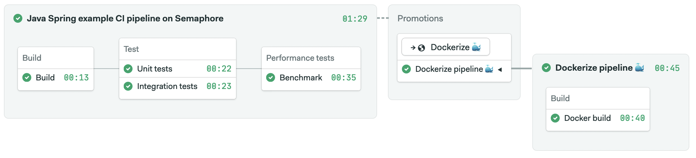

# Semaphore demo CI/CD pipeline using Java Spring

Example Spring Boot application and CI/CD pipeline showing how to run a Java
project on [Semaphore 2.0](https://semaphoreci.com).

## Application overview

### Features

 - Simple login screen
 - User registration
 - An endpoint secured with `Basic` authentification layer
 - Persistence layer for storing users in database
 
### Endpoints

 - `"/admin/home"` a secured endpoint that returns a webpage in a form of `text/html`, generated with thymeleaf. [AdminController](src/main/java/com/example/springpipelinedemo/controller/AdminController.java)
 - `"/login"` standard spring login endpoint 
 - `"/logout"` rest endpoint, ends user session, redirects to `"/login"` 
 - `"/users/signup"` rest endpoint, adds a new user to the system. [UserController](src/main/java/com/example/springpipelinedemo/controller/UserController.java)

### Persistence
 
 Persistence for this project is set up using Spring Data JPA, and utilizes `m2` database,
 which is a runtime database for the ease of testing and continuous integration, however is fully compatible with many 
 standard database technologies like Postgres.
 
 There is a single database entity [User](src/main/java/com/example/springpipelinedemo/model/User.java)
  and a corresponding repository [UserRepository](src/main/java/com/example/springpipelinedemo/repository/UserRepository.java)

### Tests

  Tests are separated into two classpaths (in order to run them as separate tasks): 
   - [src/test](src/test) holds the unit tests
   - [src/it](src/it) holds the integration tests, in this case repository and rest endpoint tests.

## CI/CD pipeline on Semaphore

The Semaphore pipeline is configured to:

  1. Build the project
  2. Run tests
  3. Build Docker image
  4. Push image to `hub.docker.com`

Semaphore pipeline configuration is located at
[.semaphore/semaphore.yml](.semaphore/semaphore.yml)

### Setting up

To set up this pipeline on your Semaphore account:

  1. If you don't have `sem` command line tool installed, do so using `curl
     https://storage.googleapis.com/sem-cli-releases/get.sh | bash` and then
     connect to your account using `sem connect <your
     organisation>.semaphoreci.com <your private key>`. You can get the private
     key from your account dashboard at `semaphoreci.com`.
  2. Add the project to Semaphore using `sem init`.
  3. This pipeline relies on public Docker repository to push artifacts of successful builds. Create an account on `https://hub.docker.com/` if you don't have one.
  4. Add your `hub.docker.com` credentials to `./docker-hub-secret.yml`. The credentials should remain private, so don't publish them to your Git repository by mistake.
  5. Add your `./docker-hub-secret.yml` credentials to Semaphore with `sem create -f docker-hub-secret.yml`
  
  
After pushing a new commit to master, Semaphore will initiate a workflow:

## Build configuration

This project is set up using Maven. Build configuration can be found at `pom.xml`.

##### Running the project

  `mvn spring-boot:run`

##### Running tests

Tests are separated into two classpaths: `src/test` for unit tests, and `src/it` for integration tests. 

To run unit tests:

  `mvn clean test`
  
To run integration tests

   `mvn clean test -Pintegration-testing`
   
To run performance tests 

   `mvn clean jmeter:jmeter`
  
##### JMeter GUI
  `mvn jmeter:gui`

## License

Copyright (c) 2020 Rendered Text

Distributed under the MIT License. See the file LICENSE.
