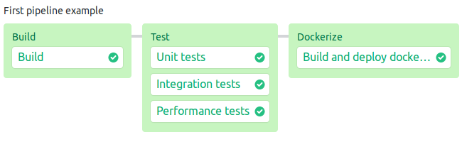

### The project

This is a simple hello world of spring boot web application.
 

##### Features:
 - Simple login screen
 - User registration
 - An endpoint secured with `Basic` authentification layer
 - Persistence layer for storing users in database
 
##### Endpoints:
 - `"/admin/home"` a secured endpoint that returns a webpage in a form of `text/html`, generated with thymeleaf. [AdminController](src/main/java/com/example/springpipelinedemo/controller/AdminController.java)
 - `"/login"` standard spring login endpoint 
 - `"/logout"` rest endpoint, ends user session, redirects to `"/login"` 
 - `"/users/signup"` rest endpoint, adds a new user to the system. [UserController](src/main/java/com/example/springpipelinedemo/controller/UserController.java)

##### Persistence:
 
 Persistence for this project is set up using spring jpa, and utilizes `m2` database,
 which is a runtime database for the ease of testing and continuous integration, however is fully compatible with many 
 standard database technologies like `postgres`.
 
 There is a single database entity [User](src/main/java/com/example/springpipelinedemo/model/User.java)
  and a corresponding repository [UserRepository](src/main/java/com/example/springpipelinedemo/repository/UserRepository.java)

##### Tests:

  Tests are separated into two classpaths (in order to run them as separate tasks): 
   - [src/test](src/test) holds the unit tests
   - [src/test](src/it) holds the integration tests, in this case repository and rest endpoint tests.

--------------------------------

### Semaphore pipeline

Current semaphore pipeline is set up to:
  1. Build the project
  2. Run tests
  3. Build docker image
  4. Push image to `hub.docker.com`

Semaphore pipeline configuration is located at `.semaphore/semaphore.yml`

----------------------------

#### Setting up

To set up this pipeline on your semaphore account :

  1. If you don't have `sem` command line tool installed, do so using `curl https://storage.googleapis.com/sem-cli-releases/get.sh | bash`
     and then connect to your account using `sem connect <your organisation>.semaphoreci.com <your private key>`, you can get the private key from your account dashboard at `semaphoreci.com`.
  2. Add project to semaphore using `sem init`
  3. This pipeline relies on public docker repository to push artifacts of successful builds. Create an account on `https://hub.docker.com/` if you don't have one.
  4. Add your `hub.docker.com` credentials to `./docker-hub-secret.yml`. The credentials should remain private, so don't publish them to your git repository by mistake.
  5. Add your `./docker-hub-secret.yml` credentials to _semaphore_ using `sem create -f docker-hub-secret.yml`
  
  
At this point the pipeline should be functional, and after pushing a new commit to master a build should initiate on _semaphore_



-------------------------------

### Build configuration

This project is set up using `maven`, maven configuration can be found at `pom.xml`

##### Running the project
  `./mvnw spring-boot:run`

##### Running tests
Tests are separated into two classpaths: `src/test` for unit tests, and `src/it` for integration tests. 

To run unit tests:

  `./mvnw clean test`
  
To run integration tests

   `./mvnw clean test -Pintegration-testing`
   
To run performance tests 

   `./mvnw clean jmeter:jmeter`
  
##### JMeter gui
  `./mvnw jmeter:gui`

------------------------------------

### Task description


```
 The project is to build a hello world kind of app which one could use as a starting point to develop a real-world project:

- Based on the latest version of Java and Spring Framework
- Dependencies managed with Maven
- Has 1 CRUD resource
- Has views/pages that provide the CRUD UI
- Uses either MySQL or PostgreSQL

There should be all kinds of tests that a professional production-level application would include:

- Model
- Controller
- Service
- Integration tests, including some browser tests
- Load testing with JMeter

Note that the goal of the project is not to teach how to write tests. One or two tests of each kind is enough.

The project should include configuration for a multi-stage CI pipeline running on Semaphore https://semaphoreci.com Use a combination of sequential blocks and parallel jobs to optimize the CI pipeline for an efficient developer feedback loop.

Refer to https://docs.semaphoreci.com for information on how to use Semaphore.

The final deliverable is a public Git repository similar to those on https://github.com/semaphoreci-demos The repo should have a Readme which contains clear working instructions on how to set up and run the application locally on Mac or Linux.

If I fork the repository and add the project to my Semaphore account, the CI pipeline should just work.

There should be just enough code and configuration to satisfy these criteria. The application will be used as education material, so anything that is repeating an already existing pattern will hinder understanding and will be a problem.

You may propose additional features of the app or CI pipeline for discussion. less 

```
